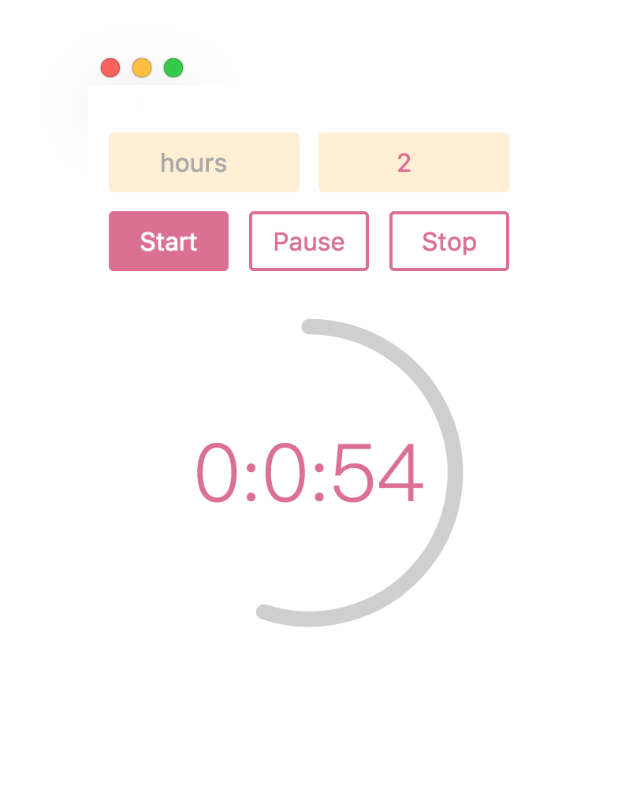

# Simple Countdown for Mac

This is a macOS app to create countdown timers, which is based on Electron and React.

## Motivation

From my personal experience, just a simple countdown can make a person concentrate effectively. But I couldn't find a free and lite enough app from App Store. So as a frontend developer, I wrote the app with the help of Electron and React.

## Installing

```
npm i

// Run the app directly
npm start

// Or build the app
npm run package-mac 
```

## Usage



1. Input 'hours' and 'minutes' fields to set up a countdown timer.
2. Click 'Start'.
3. Click 'Pause' or 'Stop' to control the timer afterwards.

## Related

* [Electron](https://github.com/electron/electron)
* [React](https://github.com/facebook/react)
* [styled components](https://github.com/styled-components/styled-components)
* [babel](https://github.com/babel/babel)
* [webpack](https://github.com/webpack/webpack)

## License

This project is licensed under the MIT License - see the [LICENSE.md](LICENSE.md) file for details

